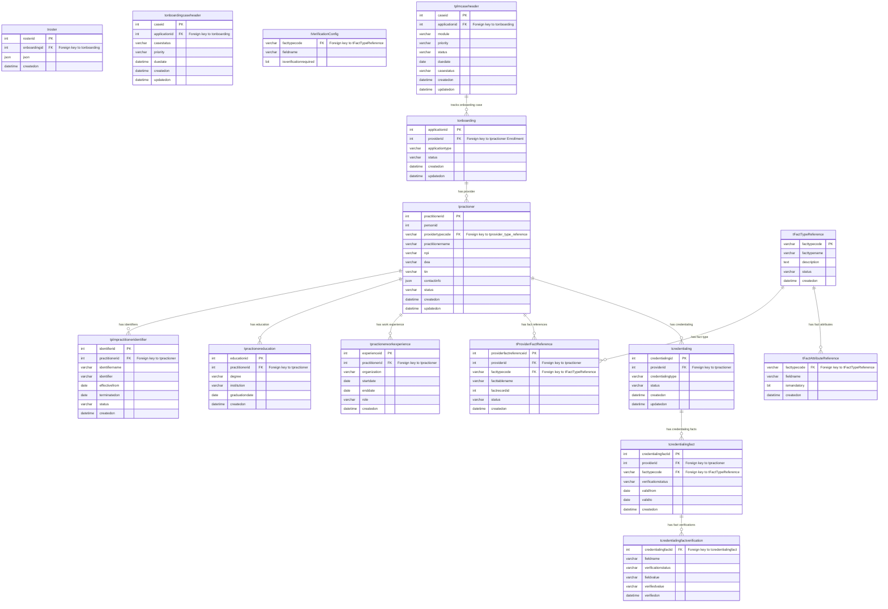

Below is the detailed schema, with tables and their columns across the **Onboarding**, **Enrollment**, and **Credentialing** domains. Each table includes a description of its columns and responsibilities.

---

## **1. Onboarding Domain**

### **Table: `tonboarding`**
Stores provider onboarding information submitted through the self-service portal or roster system.

| Column                | Type           | Description                                                               |
|-----------------------|----------------|---------------------------------------------------------------------------|
| `applicationid`        | INT (PK)       | Unique identifier for the onboarding application.                         |
| `providerid`           | INT            | Foreign key to `tpractioner` in the Enrollment domain (Provider ID).       |
| `applicationtype`      | VARCHAR(50)    | Type of application (e.g., Self-Service Portal, Roster).                   |
| `status`               | VARCHAR(20)    | Status of the onboarding application (e.g., Draft, In Progress, Submitted).|
| `createdon`            | DATETIME       | Date the application was created.                                          |
| `updatedon`            | DATETIME       | Date the application was last updated.                                     |

### **Table: `troster`**
Stores roster information associated with the provider’s onboarding.

| Column                | Type           | Description                                                               |
|-----------------------|----------------|---------------------------------------------------------------------------|
| `rosterid`            | INT (PK)       | Unique identifier for the roster submission.                               |
| `onboardingid`        | INT            | Foreign key to `tonboarding` (Onboarding Application ID).                  |
| `json`                | JSON           | Stores the roster information in JSON format.                              |
| `createdon`           | DATETIME       | Date the roster submission was created.                                    |

### **Table: `tonboardingcaseheader`**
Manages the onboarding case lifecycle, tracking status and case management.

| Column                 | Type           | Description                                                               |
|------------------------|----------------|---------------------------------------------------------------------------|
| `caseid`               | INT (PK)       | Unique identifier for the onboarding case.                                 |
| `applicationid`        | INT            | Foreign key to `tonboarding` (Onboarding Application ID).                  |
| `casestatus`           | VARCHAR(50)    | Status of the onboarding case (e.g., Open, Closed).                        |
| `priority`             | VARCHAR(50)    | Priority level of the case.                                                |
| `duedate`              | DATETIME       | The deadline for completing the case.                                      |
| `createdon`            | DATETIME       | Date the case was created.                                                 |
| `updatedon`            | DATETIME       | Date the case was last updated.                                            |

---

## **2. Enrollment Domain**

### **Table: `tpractioner`**
Stores the main provider record, including personal details.

| Column                | Type           | Description                                                               |
|-----------------------|----------------|---------------------------------------------------------------------------|
| `practitionerid`       | INT (PK)       | Unique identifier for the provider.                                        |
| `personid`             | INT            | Personal identifier for the provider (external system ID).                 |
| `providertypecode`     | VARCHAR(50)    | Foreign key to `tprovider_type_reference` (Provider Type).                 |
| `practitionername`     | VARCHAR(100)   | Name of the provider.                                                      |
| `npi`                  | VARCHAR(20)    | National Provider Identifier (NPI) for the provider.                       |
| `dea`                  | VARCHAR(20)    | DEA License number (if applicable).                                        |
| `tin`                  | VARCHAR(20)    | Tax Identification Number (TIN) for the provider.                          |
| `contactinfo`          | JSON           | Contact information stored in JSON format.                                 |
| `status`               | VARCHAR(50)    | Status of the provider record (e.g., Active, Inactive).                    |
| `createdon`            | DATETIME       | Date the provider record was created.                                      |
| `updatedon`            | DATETIME       | Date the provider record was last updated.                                 |

### **Table: `tplmpractitioneridentifier`**
Stores additional identifiers (e.g., TIN, state license) for the provider.

| Column                | Type           | Description                                                               |
|-----------------------|----------------|---------------------------------------------------------------------------|
| `identifierid`         | INT (PK)       | Unique identifier for the practitioner’s additional identifier.            |
| `practitionerid`       | INT            | Foreign key to `tpractioner` (Practitioner ID).                            |
| `identifiername`       | VARCHAR(50)    | Name of the identifier (e.g., TIN, State License).                         |
| `identifier`           | VARCHAR(50)    | Actual identifier value.                                                   |
| `effectivefrom`        | DATE           | Date from which the identifier is valid.                                   |
| `terminatedon`         | DATE           | Date the identifier was terminated (if applicable).                        |
| `status`               | VARCHAR(50)    | Status of the identifier (e.g., Active, Inactive).                         |
| `createdon`            | DATETIME       | Date the identifier was added.                                             |

### **Table: `tpractionereducation`**
Stores the education history of the provider.

| Column                | Type           | Description                                                               |
|-----------------------|----------------|---------------------------------------------------------------------------|
| `educationid`          | INT (PK)       | Unique identifier for the education record.                                |
| `practitionerid`       | INT            | Foreign key to `tpractioner` (Practitioner ID).                            |
| `degree`               | VARCHAR(100)   | Degree obtained by the provider.                                           |
| `institution`          | VARCHAR(100)   | Educational institution attended.                                          |
| `graduationdate`       | DATE           | Graduation date of the provider.                                           |
| `createdon`            | DATETIME       | Date the education record was created.                                     |

### **Table: `tpractionerworkexperience`**
Stores the work experience of the provider.

| Column                | Type           | Description                                                               |
|-----------------------|----------------|---------------------------------------------------------------------------|
| `experienceid`         | INT (PK)       | Unique identifier for the work experience record.                          |
| `practitionerid`       | INT            | Foreign key to `tpractioner` (Practitioner ID).                            |
| `organization`         | VARCHAR(100)   | Name of the organization where the provider worked.                        |
| `startdate`            | DATE           | Start date of employment.                                                  |
| `enddate`              | DATE           | End date of employment (if applicable).                                    |
| `role`                 | VARCHAR(100)   | Role or position held by the provider.                                     |
| `createdon`            | DATETIME       | Date the work experience record was created.                               |

### **Table: `tFactTypeReference`**
Defines the various fact types (e.g., education, work experience, licenses).

| Column                | Type           | Description                                                               |
|-----------------------|----------------|---------------------------------------------------------------------------|
| `facttypecode`         | VARCHAR(50) (PK) | Unique code for the fact type (e.g., Education, License).                 |
| `facttypename`         | VARCHAR(100)   | Name of the fact type.                                                     |
| `description`          | TEXT           | Description of the fact type.                                              |
| `status`               | VARCHAR(20)    | Status of the fact type (Active, Inactive).                                |
| `createdon`            | DATETIME       | Date the fact type was created.                                            |

### **Table: `tProviderFactReference`**
Links provider records to their specific fact records in different tables.

| Column                | Type           | Description                                                               |
|-----------------------|----------------|---------------------------------------------------------------------------|
| `providerfactreferenceid` | INT (PK)   | Unique identifier for the provider fact reference.                         |
| `providerid`           | INT            | Foreign key to `tpractioner` (Practitioner ID).                            |
| `facttypecode`         | VARCHAR(50)    | Foreign key to `tFactTypeReference` (Fact Type).                           |
| `facttablename`        | VARCHAR(100)   | Name of the table where the fact is stored (e.g., `tpractionereducation`). |
| `factrecordid`         | INT            | ID of the specific fact record in the related table.                       |
| `status`               | VARCHAR(20)    | Status of the fact reference (e.g., Active, Inactive).                     |
| `createdon`            | DATETIME       | Date the fact reference was created.                                       |

### **Table: `tFactAttributeReference`**
Defines which attributes of a fact type are mandatory for enrollment.

| Column                | Type           | Description                                                               |
|-----------------------|----------------|---------------------------------------------------------------------------|
| `facttypecode`         | VARCHAR(50)    | Foreign key to `tFactTypeReference` (Fact Type).                           |
| `fieldname`            | VARCHAR(100)   | Name of the attribute/field (e.g., Degree, LicenseNumber).                 |
| `ismandatory`          | BIT            | Indicates if the attribute is mandatory (0: Optional, 1: Mandatory).       |
| `PRIMARY KEY` (`facttypecode`, `fieldname`) |        | Composite primary key.                                                    |

---

## **3. Credentialing Domain**

### **Table: `tcredentialing`**
Manages the credentialing lifecycle for a provider.

| Column                | Type           | Description                                                               |
|-----------------------|----------------|---------------------------------------------------------------------------|
| `credentialingid`      | INT (PK)       | Unique identifier for the credentialing record.                            |
| `providerid`           | INT            | Foreign key to `tpractioner` (Practitioner ID).                            |
| `credentialingtype`    | VARCHAR(50)    | Type of credentialing (e.g., Primary Source Verification).                 |
| `status`               | VARCHAR(20)    | Status of the credentialing process (e.g., In Progress, Verified).         |
| `createdon`            | DATETIME       | Date the credentialing process started.                                    |
| `updatedon`            | DATETIME       | Date the credentialing record was last updated.                            |

### **Table: `tVerificationConfig`**
Defines which attributes of each fact type require verification.

| Column                | Type           | Description                                                               |
|-----------------------|----------------|---------------------------------------------------------------------------|
| `facttypecode`         | VARCHAR(50)    | Foreign key to `tFactTypeReference` (Fact Type).                           |
| `fieldname`            | VARCHAR(100)   | Name of the field that requires verification (e.g., NPI, LicenseNumber).   |
| `isverificationrequired` | BIT         | Indicates if the attribute needs verification (0: No, 1: Yes).             |
| `PRIMARY KEY` (`facttypecode`, `fieldname`) |        | Composite primary key.                                                    |

### **Table: `tcredentialingfact`**
References fact data from Enrollment and tracks the status of fact verification.

| Column                | Type           | Description                                                               |
|-----------------------|----------------|---------------------------------------------------------------------------|
| `credentialingfactid`  | INT (PK)       | Unique identifier for the credentialing fact.                              |
| `providerid`           | INT            | Foreign key to `tpractioner` (Practitioner ID).                            |
| `facttypecode`         | VARCHAR(50)    | Foreign key to `tFactTypeReference` (Fact Type).                           |
| `verificationstatus`   | VARCHAR(20)    | Status of the fact verification (e.g., Pending, Verified).                 |
| `validfrom`            | DATE           | Start date of fact validity.                                               |
| `validto`              | DATE           | End date of fact validity (if applicable).                                 |
| `createdon`            | DATETIME       | Date the credentialing fact was created.                                   |

### **Table: `tcredentialingfactverification`**
Tracks verification results at the attribute level.

| Column                | Type           | Description                                                               |
|-----------------------|----------------|---------------------------------------------------------------------------|
| `credentialingfactid`  | INT            | Foreign key to `tcredentialingfact` (Credentialing Fact ID).               |
| `fieldname`            | VARCHAR(100)   | Name of the field being verified (e.g., LicenseNumber, ExpirationDate).    |
| `verificationstatus`   | VARCHAR(20)    | Status of the verification (e.g., Pending, Verified, Failed).              |
| `fieldvalue`           | VARCHAR(100)   | Value submitted by the provider.                                           |
| `verifiedvalue`        | VARCHAR(100)   | Value that was verified.                                                   |
| `verifiedon`           | DATETIME       | Date the field was verified.                                               |
| `PRIMARY KEY` (`credentialingfactid`, `fieldname`) |  | Composite primary key.                                                    |

---

This schema provides a comprehensive view of the **Onboarding**, **Enrollment**, and **Credentialing** domains with all the core entities and the relationships between them.

Below is the **ER diagram** for the **Onboarding**, **Enrollment**, **Credentialing**, and **Case Management** domains using **Mermaid syntax**. The `plmcaseheader` is part of the **Case Management** domain and has relationships with other domains, such as **Onboarding** and **Credentialing**.

### Explanation of the ER Diagram:
- **Onboarding Domain**:
  - `tonboarding`: Stores onboarding information, related to `tpractioner` in the Enrollment domain.
  - `troster`: Stores roster submission information for onboarding.
  - `tonboardingcaseheader`: Manages the lifecycle of onboarding cases.
  
- **Enrollment Domain**:
  - `tpractioner`: Stores provider information (personal details, NPI, etc.).
  - `tplmpractitioneridentifier`: Stores additional identifiers (e.g., TIN, licenses).
  - `tpractionereducation`: Stores education records of providers.
  - `tpractionerworkexperience`: Stores work experience records.
  - `tFactTypeReference`: Defines the different fact types (e.g., education, work experience).
  - `tProviderFactReference`: Links provider facts to the provider records.
  - `tFactAttributeReference`: Specifies mandatory fields for facts.
  
- **Credentialing Domain**:
  - `tcredentialing`: Tracks the credentialing lifecycle for a provider.
  - `tVerificationConfig`: Specifies which attributes need verification.
  - `tcredentialingfact`: Links credentialing facts with provider information.
  - `tcredentialingfactverification`: Tracks the verification status of individual fact attributes.
  
- **Case Management Domain**:
  - `tplmcaseheader`: Tracks onboarding and credentialing cases. It's linked to `tonboarding`.

This structure covers the data model across the **Onboarding**, **Enrollment**, **Credentialing**, and **Case Management** domains.
