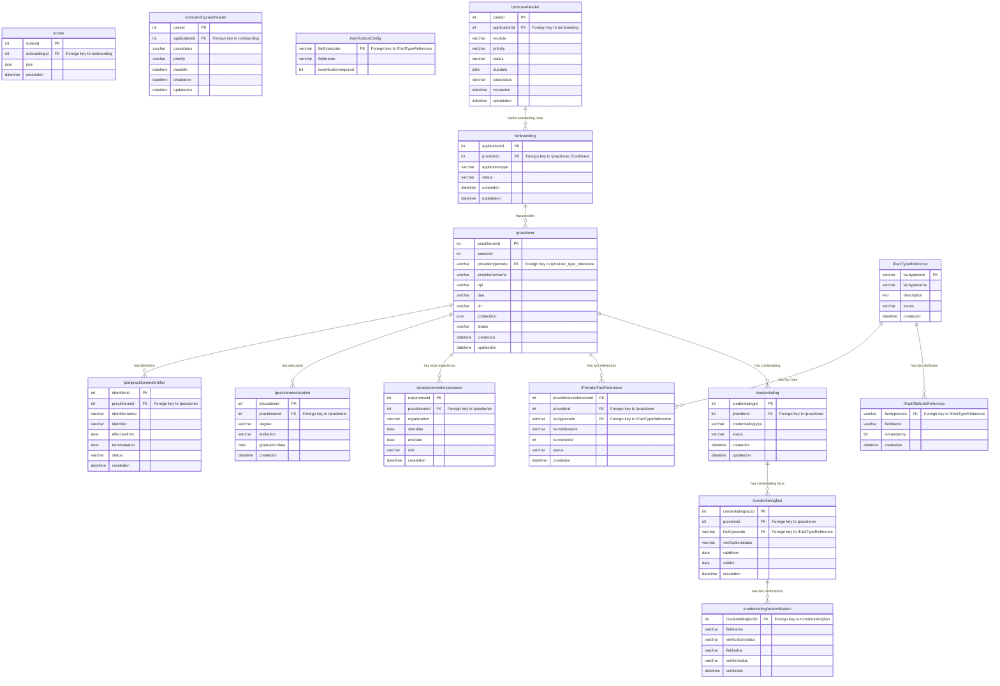

Below is the detailed schema, with tables and their columns across the **Onboarding**, **Enrollment**, and **Credentialing** domains. Each table includes a description of its columns and responsibilities.

---

## **1. Onboarding Domain**

### **Table: `tonboarding`**
Stores provider onboarding information submitted through the self-service portal or roster system.

| Column                | Type           | Description                                                               |
|-----------------------|----------------|---------------------------------------------------------------------------|
| `applicationid`        | INT (PK)       | Unique identifier for the onboarding application.                         |
| `providerid`           | INT            | Foreign key to `tpractioner` in the Enrollment domain (Provider ID).       |
| `applicationtype`      | VARCHAR(50)    | Type of application (e.g., Self-Service Portal, Roster).                   |
| `status`               | VARCHAR(20)    | Status of the onboarding application (e.g., Draft, In Progress, Submitted).|
| `createdon`            | DATETIME       | Date the application was created.                                          |
| `updatedon`            | DATETIME       | Date the application was last updated.                                     |

### **Table: `troster`**
Stores roster information associated with the provider’s onboarding.

| Column                | Type           | Description                                                               |
|-----------------------|----------------|---------------------------------------------------------------------------|
| `rosterid`            | INT (PK)       | Unique identifier for the roster submission.                               |
| `onboardingid`        | INT            | Foreign key to `tonboarding` (Onboarding Application ID).                  |
| `json`                | JSON           | Stores the roster information in JSON format.                              |
| `createdon`           | DATETIME       | Date the roster submission was created.                                    |

### **Table: `tonboardingcaseheader`**
Manages the onboarding case lifecycle, tracking status and case management.

| Column                 | Type           | Description                                                               |
|------------------------|----------------|---------------------------------------------------------------------------|
| `caseid`               | INT (PK)       | Unique identifier for the onboarding case.                                 |
| `applicationid`        | INT            | Foreign key to `tonboarding` (Onboarding Application ID).                  |
| `casestatus`           | VARCHAR(50)    | Status of the onboarding case (e.g., Open, Closed).                        |
| `priority`             | VARCHAR(50)    | Priority level of the case.                                                |
| `duedate`              | DATETIME       | The deadline for completing the case.                                      |
| `createdon`            | DATETIME       | Date the case was created.                                                 |
| `updatedon`            | DATETIME       | Date the case was last updated.                                            |

---

## **2. Enrollment Domain**

### **Table: `tpractioner`**
Stores the main provider record, including personal details.

| Column                | Type           | Description                                                               |
|-----------------------|----------------|---------------------------------------------------------------------------|
| `practitionerid`       | INT (PK)       | Unique identifier for the provider.                                        |
| `personid`             | INT            | Personal identifier for the provider (external system ID).                 |
| `providertypecode`     | VARCHAR(50)    | Foreign key to `tprovider_type_reference` (Provider Type).                 |
| `practitionername`     | VARCHAR(100)   | Name of the provider.                                                      |
| `npi`                  | VARCHAR(20)    | National Provider Identifier (NPI) for the provider.                       |
| `dea`                  | VARCHAR(20)    | DEA License number (if applicable).                                        |
| `tin`                  | VARCHAR(20)    | Tax Identification Number (TIN) for the provider.                          |
| `contactinfo`          | JSON           | Contact information stored in JSON format.                                 |
| `status`               | VARCHAR(50)    | Status of the provider record (e.g., Active, Inactive).                    |
| `createdon`            | DATETIME       | Date the provider record was created.                                      |
| `updatedon`            | DATETIME       | Date the provider record was last updated.                                 |

### **Table: `tplmpractitioneridentifier`**
Stores additional identifiers (e.g., TIN, state license) for the provider.

| Column                | Type           | Description                                                               |
|-----------------------|----------------|---------------------------------------------------------------------------|
| `identifierid`         | INT (PK)       | Unique identifier for the practitioner’s additional identifier.            |
| `practitionerid`       | INT            | Foreign key to `tpractioner` (Practitioner ID).                            |
| `identifiername`       | VARCHAR(50)    | Name of the identifier (e.g., TIN, State License).                         |
| `identifier`           | VARCHAR(50)    | Actual identifier value.                                                   |
| `effectivefrom`        | DATE           | Date from which the identifier is valid.                                   |
| `terminatedon`         | DATE           | Date the identifier was terminated (if applicable).                        |
| `status`               | VARCHAR(50)    | Status of the identifier (e.g., Active, Inactive).                         |
| `createdon`            | DATETIME       | Date the identifier was added.                                             |

### **Table: `tpractionereducation`**
Stores the education history of the provider.

| Column                | Type           | Description                                                               |
|-----------------------|----------------|---------------------------------------------------------------------------|
| `educationid`          | INT (PK)       | Unique identifier for the education record.                                |
| `practitionerid`       | INT            | Foreign key to `tpractioner` (Practitioner ID).                            |
| `degree`               | VARCHAR(100)   | Degree obtained by the provider.                                           |
| `institution`          | VARCHAR(100)   | Educational institution attended.                                          |
| `graduationdate`       | DATE           | Graduation date of the provider.                                           |
| `createdon`            | DATETIME       | Date the education record was created.                                     |

### **Table: `tpractionerworkexperience`**
Stores the work experience of the provider.

| Column                | Type           | Description                                                               |
|-----------------------|----------------|---------------------------------------------------------------------------|
| `experienceid`         | INT (PK)       | Unique identifier for the work experience record.                          |
| `practitionerid`       | INT            | Foreign key to `tpractioner` (Practitioner ID).                            |
| `organization`         | VARCHAR(100)   | Name of the organization where the provider worked.                        |
| `startdate`            | DATE           | Start date of employment.                                                  |
| `enddate`              | DATE           | End date of employment (if applicable).                                    |
| `role`                 | VARCHAR(100)   | Role or position held by the provider.                                     |
| `createdon`            | DATETIME       | Date the work experience record was created.                               |

### **Table: `tFactTypeReference`**
Defines the various fact types (e.g., education, work experience, licenses).

| Column                | Type           | Description                                                               |
|-----------------------|----------------|---------------------------------------------------------------------------|
| `facttypecode`         | VARCHAR(50) (PK) | Unique code for the fact type (e.g., Education, License).                 |
| `facttypename`         | VARCHAR(100)   | Name of the fact type.                                                     |
| `description`          | TEXT           | Description of the fact type.                                              |
| `status`               | VARCHAR(20)    | Status of the fact type (Active, Inactive).                                |
| `createdon`            | DATETIME       | Date the fact type was created.                                            |

### **Table: `tProviderFactReference`**
Links provider records to their specific fact records in different tables.

| Column                | Type           | Description                                                               |
|-----------------------|----------------|---------------------------------------------------------------------------|
| `providerfactreferenceid` | INT (PK)   | Unique identifier for the provider fact reference.                         |
| `providerid`           | INT            | Foreign key to `tpractioner` (Practitioner ID).                            |
| `facttypecode`         | VARCHAR(50)    | Foreign key to `tFactTypeReference` (Fact Type).                           |
| `facttablename`        | VARCHAR(100)   | Name of the table where the fact is stored (e.g., `tpractionereducation`). |
| `factrecordid`         | INT            | ID of the specific fact record in the related table.                       |
| `status`               | VARCHAR(20)    | Status of the fact reference (e.g., Active, Inactive).                     |
| `createdon`            | DATETIME       | Date the fact reference was created.                                       |

### **Table: `tFactAttributeReference`**
Defines which attributes of a fact type are mandatory for enrollment.

| Column                | Type           | Description                                                               |
|-----------------------|----------------|---------------------------------------------------------------------------|
| `facttypecode`         | VARCHAR(50)    | Foreign key to `tFactTypeReference` (Fact Type).                           |
| `fieldname`            | VARCHAR(100)   | Name of the attribute/field (e.g., Degree, LicenseNumber).                 |
| `ismandatory`          | BIT            | Indicates if the attribute is mandatory (0: Optional, 1: Mandatory).       |
| `PRIMARY KEY` (`facttypecode`, `fieldname`) |        | Composite primary key.                                                    |

---

## **3. Credentialing Domain**

### **Table: `tcredentialing`**
Manages the credentialing lifecycle for a provider.

| Column                | Type           | Description                                                               |
|-----------------------|----------------|---------------------------------------------------------------------------|
| `credentialingid`      | INT (PK)       | Unique identifier for the credentialing record.                            |
| `providerid`           | INT            | Foreign key to `tpractioner` (Practitioner ID).                            |
| `credentialingtype`    | VARCHAR(50)    | Type of credentialing (e.g., Primary Source Verification).                 |
| `status`               | VARCHAR(20)    | Status of the credentialing process (e.g., In Progress, Verified).         |
| `createdon`            | DATETIME       | Date the credentialing process started.                                    |
| `updatedon`            | DATETIME       | Date the credentialing record was last updated.                            |

### **Table: `tVerificationConfig`**
Defines which attributes of each fact type require verification.

| Column                | Type           | Description                                                               |
|-----------------------|----------------|---------------------------------------------------------------------------|
| `facttypecode`         | VARCHAR(50)    | Foreign key to `tFactTypeReference` (Fact Type).                           |
| `fieldname`            | VARCHAR(100)   | Name of the field that requires verification (e.g., NPI, LicenseNumber).   |
| `isverificationrequired` | BIT         | Indicates if the attribute needs verification (0: No, 1: Yes).             |
| `PRIMARY KEY` (`facttypecode`, `fieldname`) |        | Composite primary key.                                                    |

### **Table: `tcredentialingfact`**
References fact data from Enrollment and tracks the status of fact verification.

| Column                | Type           | Description                                                               |
|-----------------------|----------------|---------------------------------------------------------------------------|
| `credentialingfactid`  | INT (PK)       | Unique identifier for the credentialing fact.                              |
| `providerid`           | INT            | Foreign key to `tpractioner` (Practitioner ID).                            |
| `facttypecode`         | VARCHAR(50)    | Foreign key to `tFactTypeReference` (Fact Type).                           |
| `verificationstatus`   | VARCHAR(20)    | Status of the fact verification (e.g., Pending, Verified).                 |
| `validfrom`            | DATE           | Start date of fact validity.                                               |
| `validto`              | DATE           | End date of fact validity (if applicable).                                 |
| `createdon`            | DATETIME       | Date the credentialing fact was created.                                   |

### **Table: `tcredentialingfactverification`**
Tracks verification results at the attribute level.

| Column                | Type           | Description                                                               |
|-----------------------|----------------|---------------------------------------------------------------------------|
| `credentialingfactid`  | INT            | Foreign key to `tcredentialingfact` (Credentialing Fact ID).               |
| `fieldname`            | VARCHAR(100)   | Name of the field being verified (e.g., LicenseNumber, ExpirationDate).    |
| `verificationstatus`   | VARCHAR(20)    | Status of the verification (e.g., Pending, Verified, Failed).              |
| `fieldvalue`           | VARCHAR(100)   | Value submitted by the provider.                                           |
| `verifiedvalue`        | VARCHAR(100)   | Value that was verified.                                                   |
| `verifiedon`           | DATETIME       | Date the field was verified.                                               |
| `PRIMARY KEY` (`credentialingfactid`, `fieldname`) |  | Composite primary key.                                                    |

---

This schema provides a comprehensive view of the **Onboarding**, **Enrollment**, and **Credentialing** domains with all the core entities and the relationships between them.

Below is the **ER diagram** for the **Onboarding**, **Enrollment**, **Credentialing**, and **Case Management** domains using **Mermaid syntax**. The `plmcaseheader` is part of the **Case Management** domain and has relationships with other domains, such as **Onboarding** and **Credentialing**.

### Explanation of the ER Diagram:
- **Onboarding Domain**:
  - `tonboarding`: Stores onboarding information, related to `tpractioner` in the Enrollment domain.
  - `troster`: Stores roster submission information for onboarding.
  - `tonboardingcaseheader`: Manages the lifecycle of onboarding cases.
  
- **Enrollment Domain**:
  - `tpractioner`: Stores provider information (personal details, NPI, etc.).
  - `tplmpractitioneridentifier`: Stores additional identifiers (e.g., TIN, licenses).
  - `tpractionereducation`: Stores education records of providers.
  - `tpractionerworkexperience`: Stores work experience records.
  - `tFactTypeReference`: Defines the different fact types (e.g., education, work experience).
  - `tProviderFactReference`: Links provider facts to the provider records.
  - `tFactAttributeReference`: Specifies mandatory fields for facts.
  
- **Credentialing Domain**:
  - `tcredentialing`: Tracks the credentialing lifecycle for a provider.
  - `tVerificationConfig`: Specifies which attributes need verification.
  - `tcredentialingfact`: Links credentialing facts with provider information.
  - `tcredentialingfactverification`: Tracks the verification status of individual fact attributes.
 

Here is the updated data model with the new `tproviderenrollment` table and changes to other tables such as `tperson`, `tpersondetail`, and `tpractioner`. I have integrated the updates you provided into the Enrollment domain.

---

### **Updated Enrollment Domain Schema**

#### **1. Table: `tproviderenrollment`**
Stores provider enrollment-related information.

| Column                | Type           | Description                                               |
|-----------------------|----------------|-----------------------------------------------------------|
| `leveltypecode`        | VARCHAR(50)    | Code for the enrollment level type (e.g., Primary, Secondary). |
| `leveldescription`     | VARCHAR(255)   | Description of the enrollment level.                      |
| `leveldisplayname`     | VARCHAR(100)   | Display name for the enrollment level.                    |
| `plmproviderlevelnameid` | INT (PK)     | Unique identifier for the provider enrollment level.       |

#### **2. Table: `tperson`**
Stores personal information about the provider, such as birth date and gender.

| Column                | Type           | Description                                               |
|-----------------------|----------------|-----------------------------------------------------------|
| `personid`             | INT (PK)       | Unique identifier for the person.                         |
| `dateofbirth`          | DATE           | Date of birth of the provider.                            |
| `dateofdeath`          | DATE           | Date of death of the provider (if applicable).            |
| `gendertypecode`       | VARCHAR(10)    | Code representing the gender of the provider (e.g., Male, Female). |

#### **3. Table: `tpersondetail`**
Stores additional details about the provider such as marital status, race, and citizenship.

| Column                | Type           | Description                                               |
|-----------------------|----------------|-----------------------------------------------------------|
| `maritalstatustypecode`| VARCHAR(10)    | Code representing the marital status of the provider.      |
| `raceethnicitytypecode`| VARCHAR(10)    | Code representing the race or ethnicity of the provider.   |
| `citizenshipstatustypecode` | VARCHAR(10) | Code representing the citizenship status of the provider.  |
| `handicapped`          | BIT            | Indicates if the provider is handicapped.                 |
| `studentstatus`        | BIT            | Indicates if the provider is a student.                   |
| `validfrom`            | DATE           | Start date of the provider's details validity.            |
| `validto`              | DATE           | End date of the provider's details validity.              |

#### **4. Table: `tpractioner`**
Stores primary provider information, including personal identifiers and onboarding status.

| Column                | Type           | Description                                               |
|-----------------------|----------------|-----------------------------------------------------------|
| `personid`             | INT (FK)       | Foreign key to `tperson` (Person ID).                     |
| `providerEnrollmentId` | INT (FK)       | Foreign key to `tproviderenrollment` (Provider Enrollment ID). |
| `practitionertypecode` | VARCHAR(50)    | Code representing the practitioner type (e.g., Doctor, Nurse). |
| `practitionerid`       | INT (PK)       | Unique identifier for the practitioner.                   |
| `npi`                  | VARCHAR(20)    | National Provider Identifier for the practitioner.        |
| `fedid`                | VARCHAR(20)    | Federal identification number (if applicable).            |
| `note`                 | TEXT           | Additional notes related to the practitioner.             |
| `credentialstatustypecode` | VARCHAR(50) | Status code representing the credentialing status.         |
| `practitionercontractstatustypecode` | VARCHAR(50) | Status code representing the contract status.              |
| `practitioneronboardstatustypecode` | VARCHAR(50) | Status code representing the onboarding status.            |

#### **5. Table: `tplmpractitioneridentifier`**
Stores additional identifiers for the practitioner (e.g., TIN, licenses).

| Column                | Type           | Description                                               |
|-----------------------|----------------|-----------------------------------------------------------|
| `practitionerid`       | INT (FK)       | Foreign key to `tpractioner` (Practitioner ID).           |
| `provideridentifierid` | INT (PK)       | Unique identifier for the provider identifier.            |
| `provideridentifier`   | VARCHAR(50)    | Identifier value (e.g., TIN, License Number).             |
| `effectivefrom`        | DATE           | Date from which the identifier is effective.              |
| `terminatedon`         | DATE           | Date the identifier was terminated (if applicable).       |
| `identifierdescription` | TEXT          | Description of the identifier.                            |
| `termreason`           | VARCHAR(255)   | Reason for termination of the identifier (if applicable). |
| `registrationstatustypecode` | VARCHAR(50) | Registration status type for the identifier.               |
| `issuingauthority`     | VARCHAR(50)    | The authority that issued the identifier.                 |
| `scheduledtypecode`    | VARCHAR(50)    | Scheduled type code for the identifier (e.g., Regular, Temporary). |
| `incurrentstate`       | BIT            | Indicates if the identifier is current or active.         |
| `licensetypecode`      | VARCHAR(50)    | Code representing the type of license (if applicable).    |
| `identifierstatustypecode` | VARCHAR(50) | Status code representing the identifier’s current status.  |

#### **6. Table: `tpractionereducation`**
Stores education history for the practitioner.

| Column                | Type           | Description                                               |
|-----------------------|----------------|-----------------------------------------------------------|
| `practitionerid`       | INT (FK)       | Foreign key to `tpractioner` (Practitioner ID).           |
| `statecode`            | VARCHAR(10)    | Code representing the state where the degree was obtained.|
| `isspecialtyboardqualification` | BIT | Indicates if the degree is a specialty board qualification. |
| `specialtytypecode`    | VARCHAR(50)    | Code representing the type of specialty.                  |
| `recertificationeligibility` | BIT     | Indicates if the provider is eligible for recertification.|
| `country`              | VARCHAR(50)    | Country where the degree was obtained.                    |
| `certificatename`      | VARCHAR(100)   | Name of the certificate obtained.                         |
| `certificateissuedate` | DATE           | Date the certificate was issued.                          |
| `certificateexpirydate` | DATE          | Date the certificate expires.                             |

#### **7. Table: `tpractionerworkexperience`**
Stores work experience for the practitioner.

| Column                | Type           | Description                                               |
|-----------------------|----------------|-----------------------------------------------------------|
| `organizationname`     | VARCHAR(100)   | Name of the organization where the practitioner worked.    |
| `designation`          | VARCHAR(100)   | Role or designation at the organization.                  |
| `city`                 | VARCHAR(100)   | City where the organization is located.                   |

---

### **Updated ER Diagram with Mermaid Syntax**

---

This updated data model reflects the new **Enrollment Domain** structure, including the **provider enrollment table (`tprovideren

rollment`)** and other adjustments to the schema for handling provider-specific details such as education, work experience, and identifiers.
  
- **Case Management Domain**:
  - `tplmcaseheader`: Tracks onboarding and credentialing cases. It's linked to `tonboarding`.

This structure covers the data model across the **Onboarding**, **Enrollment**, **Credentialing**, and **Case Management** domains.

Certainly! Below is the **updated ER diagram** for the entire data model, including all domains: **Onboarding**, **Enrollment**, **Credentialing**, and **Case Management**. I've rechecked the diagram to ensure all tables and relationships are included. Following the diagram, I've provided detailed descriptions for each table, including their columns, data types, descriptions, and example data.

---

## **Combined ER Diagram**

---

## **Table Details**

Below are the detailed descriptions for each table, including columns, data types, descriptions, and example data.

### **Onboarding Domain**

#### **Table: `tonboarding`**

**Description**: Stores provider onboarding application information submitted via self-service portal or roster system.

| Column Name     | Data Type     | Description                                                        | Example Data              |
|-----------------|---------------|--------------------------------------------------------------------|---------------------------|
| applicationid   | INT (PK)      | Unique identifier for the onboarding application.                  | 1001                      |
| providerid      | INT (FK)      | FK to `tpractioner.practitionerid`.                                | 2001                      |
| applicationtype | VARCHAR(50)   | Type of application (e.g., "SelfServicePortal", "Roster").         | "SelfServicePortal"       |
| status          | VARCHAR(20)   | Current status of the application (e.g., "Draft", "Submitted").    | "Submitted"               |
| createdon       | DATETIME      | Timestamp when the application was created.                        | "2023-09-15 10:00:00"     |
| updatedon       | DATETIME      | Timestamp when the application was last updated.                   | "2023-09-15 12:00:00"     |

---

#### **Table: `troster`**

**Description**: Stores roster submission data associated with onboarding applications.

| Column Name     | Data Type     | Description                                                        | Example Data              |
|-----------------|---------------|--------------------------------------------------------------------|---------------------------|
| rosterid        | INT (PK)      | Unique identifier for the roster submission.                       | 3001                      |
| applicationid   | INT (FK)      | FK to `tonboarding.applicationid`.                                 | 1001                      |
| rosterdata      | JSON          | Roster data in JSON format.                                        | {"provider": {...}}       |
| createdon       | DATETIME      | Timestamp when the roster submission was created.                  | "2023-09-15 09:50:00"     |

---

#### **Table: `tonboardingcaseheader`**

**Description**: Manages the onboarding case lifecycle.

| Column Name  | Data Type     | Description                                                        | Example Data              |
|--------------|---------------|--------------------------------------------------------------------|---------------------------|
| caseid       | INT (PK)      | Unique identifier for the onboarding case.                         | 4001                      |
| applicationid| INT (FK)      | FK to `tonboarding.applicationid`.                                 | 1001                      |
| casestatus   | VARCHAR(50)   | Status of the case (e.g., "Open", "Closed").                       | "Open"                    |
| priority     | VARCHAR(20)   | Priority level of the case (e.g., "High", "Medium").               | "High"                    |
| duedate      | DATETIME      | Due date for the case resolution.                                  | "2023-09-20 17:00:00"     |
| createdon    | DATETIME      | Timestamp when the case was created.                               | "2023-09-15 10:05:00"     |
| updatedon    | DATETIME      | Timestamp when the case was last updated.                          | "2023-09-15 11:00:00"     |

---

### **Enrollment Domain**

#### **Table: `tperson`**

**Description**: Stores personal information about the provider.

| Column Name     | Data Type     | Description                                                        | Example Data              |
|-----------------|---------------|--------------------------------------------------------------------|---------------------------|
| personid        | INT (PK)      | Unique identifier for the person.                                  | 5001                      |
| dateofbirth     | DATE          | Date of birth of the person.                                       | "1980-01-15"              |
| dateofdeath     | DATE          | Date of death (if applicable).                                     | NULL                      |
| gendertypecode  | VARCHAR(10)   | Gender code (e.g., "M", "F", "O").                                 | "M"                       |

---

#### **Table: `tpersondetail`**

**Description**: Stores additional personal details about the provider.

| Column Name                 | Data Type     | Description                                                        | Example Data              |
|-----------------------------|---------------|--------------------------------------------------------------------|---------------------------|
| personid                    | INT (FK)      | FK to `tperson.personid`.                                          | 5001                      |
| maritalstatustypecode       | VARCHAR(10)   | Marital status code (e.g., "S", "M", "D").                         | "M"                       |
| raceethnicitytypecode       | VARCHAR(10)   | Race/Ethnicity code.                                               | "ASIAN"                   |
| citizenshipstatustypecode   | VARCHAR(10)   | Citizenship status code (e.g., "Citizen", "Resident").             | "Citizen"                 |
| handicapped                 | BIT           | Indicates if the person is handicapped (1: Yes, 0: No).            | 0                         |
| studentstatus               | BIT           | Indicates if the person is a student (1: Yes, 0: No).              | 0                         |
| validfrom                   | DATE          | Start date of validity.                                            | "2023-01-01"              |
| validto                     | DATE          | End date of validity.                                              | "2023-12-31"              |

---

#### **Table: `tproviderenrollment`**

**Description**: Stores enrollment level information for providers.

| Column Name               | Data Type     | Description                                                        | Example Data              |
|---------------------------|---------------|--------------------------------------------------------------------|---------------------------|
| plmproviderlevelnameid    | INT (PK)      | Unique identifier for the provider enrollment level.               | 6001                      |
| leveltypecode             | VARCHAR(50)   | Code representing the enrollment level type.                       | "Primary"                 |
| leveldescription          | VARCHAR(255)  | Description of the enrollment level.                               | "Primary Care Provider"   |
| leveldisplayname          | VARCHAR(100)  | Display name for the enrollment level.                             | "Primary Care"            |

---

#### **Table: `tpractioner`**

**Description**: Stores the main provider record.

| Column Name                       | Data Type     | Description                                                        | Example Data              |
|-----------------------------------|---------------|--------------------------------------------------------------------|---------------------------|
| practitionerid                    | INT (PK)      | Unique identifier for the practitioner.                            | 2001                      |
| personid                          | INT (FK)      | FK to `tperson.personid`.                                          | 5001                      |
| providerEnrollmentId              | INT (FK)      | FK to `tproviderenrollment.plmproviderlevelnameid`.                | 6001                      |
| practitionertypecode              | VARCHAR(50)   | Code representing the practitioner type (e.g., "Doctor").          | "Doctor"                  |
| npi                               | VARCHAR(20)   | National Provider Identifier.                                      | "1234567890"              |
| fedid                             | VARCHAR(20)   | Federal ID number.                                                 | "987654321"               |
| note                              | TEXT          | Additional notes about the practitioner.                           | "Specializes in Cardiology" |
| credentialstatustypecode          | VARCHAR(50)   | Credentialing status code (e.g., "Pending", "Active").             | "Active"                  |
| practitionercontractstatustypecode| VARCHAR(50)   | Contract status code.                                              | "Contracted"              |
| practitioneronboardstatustypecode | VARCHAR(50)   | Onboarding status code.                                            | "Completed"               |

---

#### **Table: `tplmpractitioneridentifier`**

**Description**: Stores additional identifiers for the provider (e.g., licenses).

| Column Name                 | Data Type     | Description                                                        | Example Data              |
|-----------------------------|---------------|--------------------------------------------------------------------|---------------------------|
| provideridentifierid        | INT (PK)      | Unique identifier for the provider identifier.                     | 7001                      |
| practitionerid              | INT (FK)      | FK to `tpractioner.practitionerid`.                                | 2001                      |
| provideridentifier          | VARCHAR(50)   | Identifier value (e.g., License Number).                           | "A1234567"                |
| effectivefrom               | DATE          | Start date of the identifier's validity.                           | "2020-01-01"              |
| terminatedon                | DATE          | Termination date of the identifier (if applicable).                | NULL                      |
| identifierdescription       | TEXT          | Description of the identifier.                                     | "State Medical License"   |
| termreason                  | VARCHAR(255)  | Reason for termination (if applicable).                            | NULL                      |
| registrationstatustypecode  | VARCHAR(50)   | Registration status code.                                          | "Active"                  |
| issuingauthority            | VARCHAR(50)   | Authority that issued the identifier.                              | "State Medical Board"     |
| scheduledtypecode           | VARCHAR(50)   | Scheduled type code (e.g., "Full", "Provisional").                 | "Full"                    |
| incurrentstate              | BIT           | Indicates if identifier is in current state (1: Yes, 0: No).       | 1                         |
| licensetypecode             | VARCHAR(50)   | License type code.                                                 | "Medical"                 |
| identifierstatustypecode    | VARCHAR(50)   | Status code of the identifier.                                     | "Active"                  |

---

#### **Table: `tpractionereducation`**

**Description**: Stores the education history of the provider.

| Column Name                      | Data Type     | Description                                                        | Example Data              |
|----------------------------------|---------------|--------------------------------------------------------------------|---------------------------|
| educationid                      | INT (PK)      | Unique identifier for the education record.                        | 8001                      |
| practitionerid                   | INT (FK)      | FK to `tpractioner.practitionerid`.                                | 2001                      |
| statecode                        | VARCHAR(10)   | State code where education was obtained.                           | "NY"                      |
| isspecialtyboardqualification    | BIT           | Indicates if it's a specialty board qualification (1: Yes, 0: No). | 1                         |
| specialtytypecode                | VARCHAR(50)   | Code representing the specialty type.                              | "Cardiology"              |
| recertificationeligibility       | BIT           | Eligibility for recertification (1: Yes, 0: No).                   | 1                         |
| country                          | VARCHAR(50)   | Country where education was obtained.                              | "USA"                     |
| certificatename                  | VARCHAR(100)  | Name of the certificate obtained.                                  | "Board Certified Cardiologist" |
| certificateissuedate             | DATE          | Date the certificate was issued.                                   | "2018-05-15"              |
| certificateexpirydate            | DATE          | Date the certificate expires.                                      | "2028-05-15"              |

---

#### **Table: `tpractionerworkexperience`**

**Description**: Stores the work experience of the provider.

| Column Name       | Data Type     | Description                                                        | Example Data              |
|-------------------|---------------|--------------------------------------------------------------------|---------------------------|
| experienceid      | INT (PK)      | Unique identifier for the work experience record.                  | 9001                      |
| practitionerid    | INT (FK)      | FK to `tpractioner.practitionerid`.                                | 2001                      |
| organizationname  | VARCHAR(100)  | Name of the organization.                                          | "General Hospital"        |
| designation       | VARCHAR(100)  | Role or designation at the organization.                           | "Attending Physician"     |
| city              | VARCHAR(100)  | City where the organization is located.                            | "New York"                |
| startdate         | DATE          | Start date of employment.                                          | "2015-06-01"              |
| enddate           | DATE          | End date of employment (if applicable).                            | NULL                      |

---

#### **Table: `tFactTypeReference`**

**Description**: Defines the various fact types (e.g., education, work experience, licenses).

| Column Name    | Data Type     | Description                                                        | Example Data              |
|----------------|---------------|--------------------------------------------------------------------|---------------------------|
| facttypecode   | VARCHAR(50) PK| Unique code representing the fact type.                            | "Education"               |
| facttypename   | VARCHAR(100)  | Name of the fact type.                                             | "Education"               |
| description    | TEXT          | Description of the fact type.                                      | "Educational background"  |
| status         | VARCHAR(20)   | Status of the fact type (e.g., "Active").                          | "Active"                  |
| createdon      | DATETIME      | Timestamp when the fact type was created.                          | "2020-01-01 09:00:00"     |

---

#### **Table: `tProviderFactReference`**

**Description**: Links provider records to their specific fact records.

| Column Name            | Data Type     | Description                                                        | Example Data              |
|------------------------|---------------|--------------------------------------------------------------------|---------------------------|
| providerfactreferenceid| INT (PK)      | Unique identifier for the provider fact reference.                 | 10001                     |
| providerid             | INT (FK)      | FK to `tpractioner.practitionerid`.                                | 2001                      |
| facttypecode           | VARCHAR(50) FK| FK to `tFactTypeReference.facttypecode`.                           | "Education"               |
| facttablename          | VARCHAR(100)  | Name of the table where the fact is stored.                        | "tpractionereducation"    |
| factrecordid           | INT           | ID of the specific fact record.                                    | 8001                      |
| status                 | VARCHAR(20)   | Status of the fact reference (e.g., "Active").                     | "Active"                  |
| createdon              | DATETIME      | Timestamp when the fact reference was created.                     | "2023-09-15 10:30:00"     |

---

#### **Table: `tFactAttributeReference`**

**Description**: Defines which attributes of a fact type are mandatory during enrollment.

| Column Name   | Data Type     | Description                                                        | Example Data              |
|---------------|---------------|--------------------------------------------------------------------|---------------------------|
| facttypecode  | VARCHAR(50) FK| FK to `tFactTypeReference.facttypecode`.                           | "Education"               |
| fieldname     | VARCHAR(100)  | Name of the attribute/field.                                       | "degree"                  |
| ismandatory   | BIT           | Indicates if the field is mandatory (1: Yes, 0: No).               | 1                         |
| createdon     | DATETIME      | Timestamp when the attribute reference was created.                | "2023-01-01 09:00:00"     |

---

### **Credentialing Domain**

#### **Table: `tcredentialing`**

**Description**: Manages the credentialing lifecycle for a provider.

| Column Name          | Data Type     | Description                                                        | Example Data              |
|----------------------|---------------|--------------------------------------------------------------------|---------------------------|
| credentialingid      | INT (PK)      | Unique identifier for the credentialing process.                   | 11001                     |
| providerid           | INT (FK)      | FK to `tpractioner.practitionerid`.                                | 2001                      |
| credentialingtype    | VARCHAR(50)   | Type of credentialing (e.g., "Initial").                           | "Initial"                 |
| status               | VARCHAR(20)   | Status of the credentialing process (e.g., "Pending").             | "Pending"                 |
| createdon            | DATETIME      | Timestamp when the credentialing process started.                  | "2023-09-16 09:00:00"     |
| updatedon            | DATETIME      | Timestamp when the credentialing process was last updated.         | "2023-09-17 11:00:00"     |

---

#### **Table: `tcredentialingfact`**

**Description**: References fact data from Enrollment and tracks verification status.

| Column Name               | Data Type     | Description                                                        | Example Data              |
|---------------------------|---------------|--------------------------------------------------------------------|---------------------------|
| credentialingfactid       | INT (PK)      | Unique identifier for the credentialing fact.                      | 12001                     |
| credentialingid           | INT (FK)      | FK to `tcredentialing.credentialingid`.                            | 11001                     |
| facttypecode              | VARCHAR(50) FK| FK to `tFactTypeReference.facttypecode`.                           | "Education"               |
| providerfactreferenceid   | INT (FK)      | FK to `tProviderFactReference.providerfactreferenceid`.            | 10001                     |
| verificationstatus        | VARCHAR(20)   | Verification status (e.g., "Pending").                             | "Pending"                 |
| validfrom                 | DATE          | Start date of fact validity.                                       | "2023-09-15"              |
| validto                   | DATE          | End date of fact validity.                                         | "2024-09-15"              |
| createdon                 | DATETIME      | Timestamp when the credentialing fact was created.                 | "2023-09-16 09:15:00"     |

---

#### **Table: `tVerificationConfig`**

**Description**: Defines which attributes of each fact type require verification.

| Column Name            | Data Type     | Description                                                        | Example Data              |
|------------------------|---------------|--------------------------------------------------------------------|---------------------------|
| facttypecode           | VARCHAR(50) FK| FK to `tFactTypeReference.facttypecode`.                           | "Education"               |
| fieldname              | VARCHAR(100)  | Name of the field requiring verification.                          | "degree"                  |
| isverificationrequired | BIT           | Indicates if verification is required (1: Yes, 0: No).             | 1                         |

---

#### **Table: `tcredentialingfactverification`**

**Description**: Tracks verification results at the attribute level.

| Column Name           | Data Type     | Description                                                        | Example Data              |
|-----------------------|---------------|--------------------------------------------------------------------|---------------------------|
| credentialingfactid   | INT (FK)      | FK to `tcredentialingfact.credentialingfactid`.                    | 12001                     |
| fieldname             | VARCHAR(100)  | Name of the field being verified.                                  | "degree"                  |
| verificationstatus    | VARCHAR(20)   | Verification status (e.g., "Pending", "Verified").                 | "Pending"                 |
| fieldvalue            | VARCHAR(100)  | Value submitted by the provider.                                   | "MD"                      |
| verifiedvalue         | VARCHAR(100)  | Value verified externally (if any).                                | NULL                      |
| verifiedon            | DATETIME      | Timestamp when the field was verified.                             | NULL                      |

---

#### **Table: `tcredentialingfactnote`**

**Description**: Stores notes related to the credentialing fact.

| Column Name           | Data Type     | Description                                                        | Example Data              |
|-----------------------|---------------|--------------------------------------------------------------------|---------------------------|
| credentialingfactid   | INT (FK)      | FK to `tcredentialingfact.credentialingfactid`.                    | 12001                     |
| noteid                | INT (PK)      | Unique identifier for the note.                                    | 13001                     |
| note                  | TEXT          | Content of the note.                                               | "Verification pending with university." |
| createdon             | DATETIME      | Timestamp when the note was created.                               | "2023-09-16 10:00:00"     |

---

### **Case Management Domain**

#### **Table: `tplmcaseheader`**

**Description**: Manages cases across domains, including onboarding and credentialing.

| Column Name   | Data Type     | Description                                                        | Example Data              |
|---------------|---------------|--------------------------------------------------------------------|---------------------------|
| caseid        | INT (PK)      | Unique identifier for the case.                                    | 4001                      |
| applicationid | INT (FK)      | FK to `tonboarding.applicationid`.                                 | 1001                      |
| module        | VARCHAR(50)   | Module associated with the case (e.g., "Onboarding").              | "Onboarding"              |
| priority      | VARCHAR(20)   | Priority level of the case.                                        | "High"                    |
| status        | VARCHAR(20)   | Status of the case (e.g., "Open", "Closed").                       | "Open"                    |
| duedate       | DATE          | Due date for the case.                                             | "2023-09-20"              |
| casestatus    | VARCHAR(50)   | Detailed status of the case.                                       | "Pending Review"          |
| createdon     | DATETIME      | Timestamp when the case was created.                               | "2023-09-15 10:05:00"     |
| updatedon     | DATETIME      | Timestamp when the case was last updated.                          | "2023-09-15 11:00:00"     |

---

This comprehensive overview includes all tables, their relationships, and detailed information about each column, fulfilling your request to recheck the ER diagram and provide detailed table descriptions with example data.
