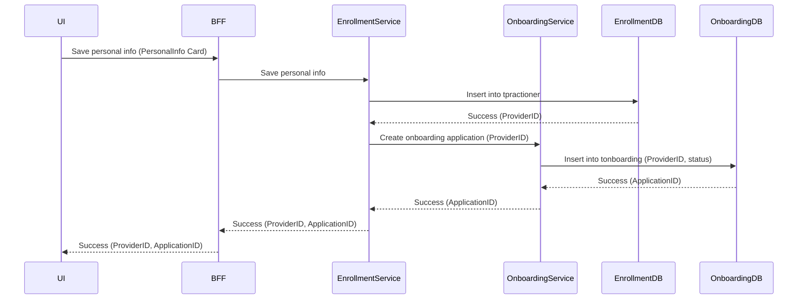

Here’s a well-structured document based on our discussion, which you can present to stakeholders or your team. This document outlines the architectural design, the changes to the schema, and the rationale behind them. It also highlights potential improvements and risks, along with mitigation strategies.

---

# **Design Document for Provider Onboarding, Enrollment, and Credentialing System**

## **Overview**

This document outlines the architectural changes needed for moving the fact type and fact reference tables to the Enrollment domain while maintaining the fact verification and mandatory attribute configurations in their respective domains. The goal is to ensure a clear separation of responsibilities between **Onboarding**, **Enrollment**, and **Credentialing** domains, while facilitating smooth cross-domain interactions.

---

## **Domains and Responsibilities**

### **1. Onboarding Domain**
- **Purpose**: This domain is responsible for collecting and storing initial application data submitted by the provider. Once the application is approved, the data is passed to the Enrollment domain for further processing.
- **Core Entities**:
  - `tonboarding`: Stores provider onboarding information.
  - `troster`: Stores roster information associated with the provider's onboarding.
  - `tonboardingcaseheader`: Manages the onboarding case lifecycle.

### **2. Enrollment Domain**
- **Purpose**: This domain is responsible for managing provider information such as personal details, education history, work experience, and licenses. It ensures data completeness by enforcing mandatory attributes.
- **Core Entities**:
  - `tpractioner`: Stores the main provider record.
  - `tplmpractitioneridentifier`, `tpractionereducation`, `tpractionerworkexperience`: Store provider-specific facts.
  - `tFactTypeReference`: Defines the various fact types (e.g., education, work experience, licenses) and whether a fact is mandatory for enrollment.
  - `tProviderFactReference`: Links provider records to their specific fact records in different tables.
  - `tFactAttributeReference`: Defines which attributes of a fact type are mandatory during enrollment.

### **3. Credentialing Domain**
- **Purpose**: The Credentialing domain verifies the provider's submitted data to ensure compliance with regulatory or internal organizational standards. It maintains policies and rules related to fact verification.
- **Core Entities**:
  - `tcredentialing`: Manages the credentialing lifecycle for a provider.
  - `tVerificationConfig`: Defines which attributes of each fact type require verification.
  - `tcredentialingfact`: References fact data from Enrollment and tracks the status of fact verification.
  - `tcredentialingfactverification`: Tracks verification results at the attribute level.
  
---

## **Key Architectural Decisions**

### **A. Move `tFactTypeReference` and `tProviderFactReference` to the Enrollment Domain**

- **Why**: 
  - The Enrollment domain is responsible for managing provider data, making it the natural location for fact type definitions (`tFactTypeReference`) and provider fact references (`tProviderFactReference`).
  - Credentialing will use the fact definitions and provider fact references stored in Enrollment but will not manage them directly.

### **B. Maintain Fact Verification in Credentialing Domain**

- **Why**: 
  - Verification of fact attributes is an essential part of the credentialing process, which is driven by compliance and regulatory requirements. 
  - Therefore, the Credentialing domain will manage which fact attributes need to be verified.

### **C. Maintain Mandatory Attributes in Enrollment Domain**

- **Why**: 
  - The Enrollment domain is responsible for data completeness and ensuring that all necessary provider information is collected. 
  - Therefore, the Enrollment domain will manage the mandatory status of fact attributes.

---

## **Schema Changes**

### **1. Changes in the Enrollment Domain**

#### **1.1 `tFactTypeReference` (Moved to Enrollment)**
Defines the types of facts (e.g., education, work experience, licenses) that can be associated with a provider.

```sql
CREATE TABLE tFactTypeReference (
    FactTypeCode VARCHAR(50) PRIMARY KEY,
    FactTypeName VARCHAR(100),
    FactCategory VARCHAR(50),
    Description TEXT,
    IsMandatory BIT DEFAULT 0,  -- Indicates if the fact is mandatory for enrollment
    CreatedOn DATETIME DEFAULT GETDATE(),
    Status VARCHAR(20) DEFAULT 'Active'
);
```

#### **1.2 `tProviderFactReference` (Moved to Enrollment)**
Links providers to their specific fact records across different fact tables.

```sql
CREATE TABLE tProviderFactReference (
    ProviderFactReferenceID INT IDENTITY(1,1) PRIMARY KEY,
    ProviderID INT NOT NULL,  -- FK to tpractioner or provider table in Enrollment
    FactTypeCode VARCHAR(50) NOT NULL,  -- FK to tFactTypeReference
    FactTableName VARCHAR(100) NOT NULL,  -- e.g., tpractionereducation, tplmpractitioneridentifier
    FactRecordID INT NOT NULL,
    CreatedOn DATETIME DEFAULT GETDATE(),
    Status VARCHAR(20) DEFAULT 'Active',
    FOREIGN KEY (ProviderID) REFERENCES tpractioner(PractitionerID),
    FOREIGN KEY (FactTypeCode) REFERENCES tFactTypeReference(FactTypeCode)
);
```

#### **1.3 `tFactAttributeReference` (New in Enrollment)**
Defines which attributes of a fact type are mandatory for provider enrollment.

```sql
CREATE TABLE tFactAttributeReference (
    FactTypeCode VARCHAR(50),  -- FK to tFactTypeReference
    FieldName VARCHAR(100),  -- Attribute of the fact type (e.g., Degree, LicenseNumber)
    IsMandatory BIT DEFAULT 0,  -- Indicates if the attribute is mandatory for enrollment
    PRIMARY KEY (FactTypeCode, FieldName),
    FOREIGN KEY (FactTypeCode) REFERENCES tFactTypeReference(FactTypeCode)
);
```

### **2. Changes in the Credentialing Domain**

#### **2.1 `tVerificationConfig` (New in Credentialing)**
Defines which attributes of each fact type need verification during the credentialing process.

```sql
CREATE TABLE tVerificationConfig (
    FactTypeCode VARCHAR(50),  -- FK to Enrollment.tFactTypeReference
    FieldName VARCHAR(100),  -- Attribute of the fact type
    IsVerificationRequired BIT DEFAULT 0,  -- Indicates if the attribute needs verification
    PRIMARY KEY (FactTypeCode, FieldName),
    FOREIGN KEY (FactTypeCode) REFERENCES Enrollment.tFactTypeReference(FactTypeCode)
);
```

#### **2.2 `tcredentialingfact` (Updated in Credentialing)**
Tracks fact verification processes and references facts from Enrollment using `ProviderFactReferenceID`.

```sql
ALTER TABLE tcredentialingfact
ADD ProviderFactReferenceID INT NOT NULL,
    FOREIGN KEY (ProviderFactReferenceID) REFERENCES Enrollment.tProviderFactReference(ProviderFactReferenceID);
```

---

## **Process Flow and Domain Interaction**

### **1. Onboarding to Enrollment Flow**

1. **Onboarding Process**:
   - Provider submits data via an onboarding form.
   - The system validates and processes the data in the Onboarding domain.

2. **Transition to Enrollment**:
   - Once the onboarding process is complete, provider data is transferred to the Enrollment domain, where facts are stored, and attributes are validated based on the rules defined in `tFactAttributeReference`.

### **2. Enrollment to Credentialing Flow**

1. **Fact Definition and Fact Reference Management**:
   - The Enrollment domain manages fact definitions (`tFactTypeReference`) and links specific fact instances to providers (`tProviderFactReference`).
   - Credentialing references these facts when needed during the verification process.

2. **Verification Configuration**:
   - The Credentialing domain uses `tVerificationConfig` to determine which attributes of a fact need verification. It references fact definitions in Enrollment but manages its own verification policies.

3. **Fact Verification**:
   - Credentialing processes verify the necessary attributes and update the verification status in `tcredentialingfactverification`.

---

## **Potential Issues and Mitigation Strategies**

### **Issue 1: Cross-Domain Dependencies**
- **Problem**: Credentialing relies on Enrollment for fact definitions and provider fact references. If Enrollment is down, Credentialing operations may be impacted.
- **Mitigation**:
  - **Caching**: Credentialing can cache fact definitions and provider fact references to reduce dependency on live Enrollment services.
  - **High Availability**: Ensure that Enrollment services are highly available, and use fault-tolerant architecture to minimize downtime.

### **Issue 2: Data Consistency**
- **Problem**: Changes in Enrollment (e.g., new fact types, updated mandatory attributes) could affect Credentialing processes if not handled carefully.
- **Mitigation**:
  - **Event-Driven Architecture**: Use domain events to notify Credentialing whenever there is a change in Enrollment that affects fact definitions or attributes.
  - **Data Synchronization**: Ensure regular synchronization of fact definitions and rules between Enrollment and Credentialing domains.

### **Issue 3: Performance Overhead**
- **Problem**: Cross-domain calls for fact definitions or provider fact references may introduce latency.
- **Mitigation**:
  - **Optimize Queries**: Use indexes and query optimization techniques in both Enrollment and Credentialing to ensure fast data access.
  - **Batch Processing**: Where applicable, batch verification processes to minimize the number of cross-domain calls.

---

## **Recommendations for Improvement**

### **1. API-Based Communication Between Domains**
- **Implement API endpoints** for the Enrollment domain that allow the Credentialing domain to retrieve fact definitions and provider fact references. This promotes loose coupling and encapsulation of domain responsibilities.

### **2. Use Event-Driven Updates**
- **Implement event-driven mechanisms** (e.g., using a message broker like Kafka or RabbitMQ) to notify the Credentialing domain of changes in fact definitions or mandatory attributes in Enrollment. This ensures that Credentialing is always up-to-date without requiring synchronous calls.

###


Great! In a **synchronous approach**, you can ensure transactional consistency by including the API calls to both the **Enrollment** and **Onboarding BFF APIs** as part of the same workflow. By executing these actions within the same transaction, you avoid integrity issues (such as saving data in Enrollment but failing to create an onboarding application).

Here’s a detailed explanation of how we can design this **synchronous transaction** approach for managing onboarding status.

---

### **1. Synchronous Flow for Managing Onboarding Status**

In this design, the **Enrollment service** will handle both the saving of provider information and the creation of the onboarding application in a single workflow by directly calling the **Onboarding BFF APIs**. Both operations will be part of the same transaction, ensuring that if one fails, the entire operation rolls back, preventing data inconsistencies.

---

### **2. Step-by-Step Process for Updating Onboarding Status**

#### **Step 1: Save Provider Information (Personal Information) in Enrollment Database**

- **Action**: The provider fills out a **personal information card** on the UI. When they click "Save," the UI sends the data to the **BFF API**.
- **Process**:
  1. The **BFF API** calls the **Enrollment microservice** to save the provider's personal information.
  2. The **Enrollment microservice** inserts the personal information into the `tpractioner` table.
  3. Once the provider information is saved successfully, the Enrollment microservice proceeds to the next step to create an onboarding application.
  
  **Database Insertion** (in **Enrollment DB**):

  ```sql
  INSERT INTO tpractioner (personid, practitionername, contactinfo, ...) 
  VALUES (...);
  ```

#### **Step 2: Create Onboarding Application in Onboarding Database**

- **Action**: After saving provider information, the Enrollment service synchronously calls the **Onboarding BFF API** to create the onboarding application.
- **Process**:
  1. The **Enrollment service** sends a request to the **Onboarding BFF API** to create an onboarding application with the `ProviderID` received from Step 1.
  2. The **Onboarding service** creates a new record in the `tonboarding` table in the **Onboarding Database** and assigns the application an initial status of `Draft` or `In Progress`.
  3. The Onboarding service returns the `ApplicationID` to the Enrollment service.
  
  **Database Insertion** (in **Onboarding DB**):

  ```sql
  INSERT INTO tonboarding (applicationtype, providerid, status, createdon, ...) 
  VALUES (...);
  ```

#### **Step 3: Ensure Transactional Consistency**

- **Transaction**: Both saving provider data in **Enrollment** and creating the onboarding application in **Onboarding** are part of a single **distributed transaction**.
- **Commit or Rollback**: If either the Enrollment or Onboarding service fails at any point, the entire transaction is rolled back to avoid inconsistent data.
  
  - If the **Onboarding application creation** fails, the provider’s personal information saved in the Enrollment database will be rolled back.
  - If the **Enrollment save operation** fails, the onboarding application will not be created.

  **Example using a transaction management library** (pseudo code):

  ```java
  @Transactional
  public void saveProviderAndCreateOnboarding(ProviderData providerData) {
      try {
          // Save provider data in Enrollment DB
          Long providerId = enrollmentService.saveProviderData(providerData);

          // Call Onboarding BFF API to create an onboarding application
          OnboardingApplicationResponse response = onboardingBFFApi.createOnboardingApplication(providerId);
          
          // Onboarding and Enrollment both successful, commit the transaction
      } catch (Exception e) {
          // If any error occurs, rollback the transaction
          throw new TransactionalException("Transaction failed. Rolling back...", e);
      }
  }
  ```

#### **Step 4: Updating the Status**

The status of the onboarding application will be updated based on the progress of the provider's information being filled out. The status will be managed centrally in the **Onboarding database** via synchronous updates from the Enrollment service.

- **Scenario**: As the provider fills out more sections (cards), the status of the onboarding application is progressively updated.
- **Example**:
  - **First card saved (personal info)**: The status is set to `In Progress`.
  - **All sections completed and submitted**: The status is updated to `Submitted`.
  - **After admin approval**: The status is updated to `Approved`.

---

### **3. High-Level Sequence of Operations**

1. **UI sends personal information** to the BFF API.
2. **BFF API calls the Enrollment service** to save provider information.
3. After the personal information is successfully saved, the **Enrollment service calls the Onboarding BFF API** to create an onboarding application.
4. **Onboarding BFF API creates the application**, assigns the `ApplicationID`, and returns it to the Enrollment service.
5. **Both actions succeed**, and the entire transaction is committed.

---

### **4. Sequence Diagram for Synchronous Status Updates**



---

### **5. Handling Status Updates for Future Cards (Education, Work Experience)**

As the provider fills out more sections (cards) of the onboarding form, the **Enrollment service** will continue updating the **Onboarding service** synchronously.

#### **Steps for Each Card Save**

1. **UI saves education info** (or other sections).
2. The **BFF API** calls the **Enrollment service** to save this information.
3. The **Enrollment service** saves the data and synchronously updates the **Onboarding service** by calling its API to reflect the status change (e.g., `In Progress`).
4. The **Onboarding service** updates the `tonboarding` table in the **Onboarding DB** with the latest status.

#### **Status Updates for Each Stage**

- **Draft**: Initial status when the provider starts the application.
- **In Progress**: After the provider saves at least one section (e.g., personal info).
- **Submitted**: Once the provider has completed and submitted all sections.
- **Approved**: Once the admin approves the application.

---

### **6. Transaction Management and Integrity**

To maintain integrity across the different operations, we will ensure that all operations (both **Enrollment** and **Onboarding**) are part of the same **transactional context**.

#### **Key Considerations for Transactional Management:**

1. **Distributed Transaction Support**:
   - Use a transaction manager to handle distributed transactions that span multiple services.
   - Ensure that either both the **Enrollment save operation** and **Onboarding application creation** succeed, or both fail and roll back.

2. **Timeouts and Failures**:
   - Implement timeouts for calls to the Onboarding BFF API to prevent long waits in case of failures.
   - Use circuit breaker patterns to handle temporary unavailability of the Onboarding service.

---

### **7. Status Management and Database Schema Adjustments**

#### **Onboarding DB (`tonboarding` table)**

We will store the onboarding status in the **Onboarding database**, allowing the Enrollment service to update the status when necessary.

**Schema for `tonboarding`:**

```sql
CREATE TABLE tonboarding (
    applicationid INT PRIMARY KEY,
    providerid INT,  -- FK to tpractioner in Enrollment DB
    applicationtype VARCHAR(50),
    status VARCHAR(20),  -- Draft, In Progress, Submitted, Approved
    createdon DATETIME,
    updatedon DATETIME,
    FOREIGN KEY (providerid) REFERENCES Enrollment.tpractioner(practitionerid)
);
```

- **Status Field**: This field will be updated by synchronous calls from the Enrollment service based on the progress of the provider’s form completion.

---

### **8. Error Handling and Rollback**

To ensure consistency and reliability, implement robust error-handling mechanisms:

1. **If the Onboarding service fails**: Roll back the provider data insertion in the Enrollment database.
2. **If the Enrollment service fails**: No call should be made to the Onboarding service, and no onboarding application should be created.
3. **Implement retries**: In case of transient failures, retries should be managed by the Enrollment service to ensure that the onboarding application is eventually created if it initially fails.

---

### **9. Benefits of Synchronous Transactional Approach**

1. **Data Consistency**: Ensures that both the **Enrollment DB** and **Onboarding DB** are updated together, preventing partial failures.
2. **Simplicity**: Easier to implement compared to an asynchronous event-driven approach, as it doesn’t require message queues or event handling.
3. **Immediate Feedback**: The UI gets immediate confirmation that the provider information has been saved and the onboarding application has been created.

---

### **Conclusion**

By using a synchronous, transaction-based approach, we ensure that provider information and onboarding applications are created together as part of a single transaction. This guarantees consistency and avoids potential integrity issues. The **Enrollment service** will handle both data-saving operations and status updates by calling the **Onboarding BFF API** and committing the changes only when both operations are successful.
