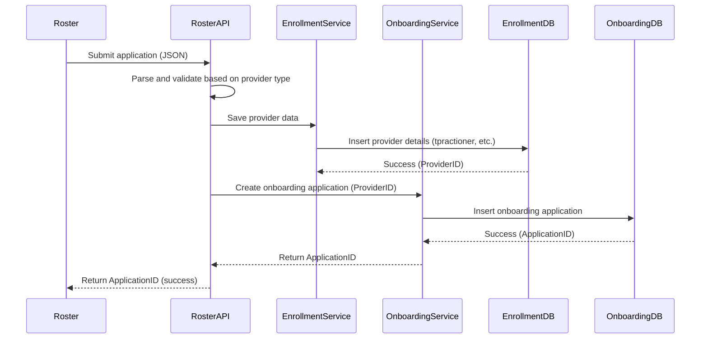

Here’s the detailed document for the **Roster System** onboarding process, based on the discussions we’ve had. This document covers the requirements, data model adjustments, processing logic, error handling, and design of the entire system.

---

# **Roster System Onboarding Process**

## **Overview**

The **Roster System** is responsible for submitting provider onboarding applications via API calls. Unlike bulk submissions, each application is submitted independently as a single API request. The system processes the application form, validates the provider’s details (some of which may be optional depending on the provider type), and returns an application ID for each successful submission.

---

## **Key Requirements**

1. **Single API Submission**: Each application is received via a separate API call. Bulk applications are not handled together.
2. **Optional Fields**: Provider details such as education, work experience, and identifiers (e.g., DEA, TIN) may be optional, based on the provider type (e.g., Doctor, Nurse).
3. **Provider Type-Specific Validation**: The system needs to validate mandatory and optional fields based on the provider type. Different provider types have different requirements.
4. **Transactional Integrity**: Each application submission must be processed as a transaction. If any part of the process (Enrollment or Onboarding) fails, the entire transaction must be rolled back.
5. **Response**: The system returns an **Application ID** for each successful submission or an **error message** for failed submissions.
6. **Error Handling**: Each application is processed individually. In case of failure, only the application in the current API call is affected.

---

## **1. Roster Submission Flow**

### **Step 1: Roster Submits an Application**

- The Roster system sends a JSON payload to the **Roster API**, which contains the entire provider application form.
- Each submission is treated as an independent request.

**Example JSON Payload:**
```json
{
  "provider": {
    "personalInfo": {
      "name": "John Doe",
      "npi": "123456789",
      "email": "john.doe@example.com"
    },
    "education": [
      {
        "degree": "MD",
        "institution": "XYZ University",
        "graduationDate": "2010-05-20"
      }
    ],
    "workExperience": [
      {
        "organization": "ABC Hospital",
        "startDate": "2012-06-01",
        "endDate": "2018-08-31"
      }
    ],
    "identifiers": {
      "dea": "ABC1234567",
      "tin": "987654321"
    }
  }
}
```

---

### **Step 2: Determine Provider Type and Validate Fields**

- The **Roster API** parses the JSON and determines the **provider type** (e.g., Doctor, Nurse).
- The system looks up the **mandatory fields** for the provider type using the `tprovider_type_field_rules` table.
- **Validation**: 
  - Checks if all mandatory fields are present (e.g., NPI, DEA).
  - Verifies the correctness of the data format (e.g., NPI length, TIN format).
  - Allows optional fields to be missing.

**Example Validation:**
- For a **Doctor**, fields like `npi`, `dea`, and `education` might be mandatory.
- For a **Nurse**, only the `npi` might be mandatory, while `dea` is optional.

---

### **Step 3: Save Provider Data in Enrollment Database**

- Once the application passes validation, the **Roster API** saves the provider’s personal information, education, work experience, and identifiers in the **Enrollment database**.
  
- The **Enrollment service** inserts data into the relevant tables, such as `tpractioner`, `tpractionereducation`, and `tpractionerworkexperience`.

**Database Operations:**
- Insert provider data into the `tpractioner` table:
  ```sql
  INSERT INTO tpractioner (personid, practitionername, npi, dea, tin, contactinfo, ...) 
  VALUES (...);
  ```

---

### **Step 4: Create Onboarding Application in Onboarding Database**

- After successfully saving the provider data in the **Enrollment database**, the **Roster API** synchronously calls the **Onboarding BFF API**.
- The **Onboarding service** creates a new application in the **Onboarding database** and assigns the application an ID.
  
**Database Operations:**
- Insert a new onboarding application into the `tonboarding` table:
  ```sql
  INSERT INTO tonboarding (applicationtype, providerid, status, ...) 
  VALUES (...);
  ```

---

### **Step 5: Return Application ID as Response**

- Upon successful processing, the **Onboarding BFF API** returns the `ApplicationID` to the **Roster API**.
- The **Roster API** then returns the `ApplicationID` as the response for the API call.
- If the application fails due to validation or processing errors, an **error message** is returned instead.

**Response Example (Success)**:
```json
{
  "applicationId": "APP12345"
}
```

**Response Example (Error)**:
```json
{
  "error": "Missing mandatory field: NPI"
}
```

---

### **6. Transactional Processing and Error Handling**

#### **A. Transaction Management**

- Both the Enrollment and Onboarding processes must be part of a single transaction.
- If the provider data is saved successfully in the Enrollment database but the onboarding application fails to be created, the system should **roll back** the entire transaction.

#### **B. Error Handling Scenarios**

- **Validation Errors**:
  - If a field is missing or improperly formatted, the system immediately returns an error and does not attempt to save the data.
  
- **Processing Errors**:
  - If saving to the Enrollment database fails, the process is halted, and the system returns an error.
  - If the **Onboarding service** fails after the **Enrollment service** has successfully saved the provider data, the entire transaction is rolled back.

---

### **7. Data Model Adjustments for Roster Submissions**

#### **A. New Tables for Provider Type Rules**

To handle the variation in mandatory and optional fields based on the provider type, the following tables are introduced:

#### **1. `tprovider_type_reference` (New Table)**

This table stores the different provider types (e.g., Doctor, Nurse) and their descriptions.

```sql
CREATE TABLE tprovider_type_reference (
    providertypecode VARCHAR(50) PRIMARY KEY,
    providertypename VARCHAR(100),
    description TEXT
);
```

#### **2. `tprovider_type_field_rules` (New Table)**

This table defines the mandatory and optional fields for each provider type.

```sql
CREATE TABLE tprovider_type_field_rules (
    providertypecode VARCHAR(50),  -- FK to tprovider_type_reference
    fieldname VARCHAR(100),  -- e.g., 'npi', 'dea', 'education', etc.
    ismandatory BIT DEFAULT 0,
    PRIMARY KEY (providertypecode, fieldname),
    FOREIGN KEY (providertypecode) REFERENCES tprovider_type_reference(providertypecode)
);
```

#### **B. Adjustments to `tpractioner`**

The `tpractioner` table stores provider details and now references the **provider type** to validate mandatory fields.

```sql
CREATE TABLE tpractioner (
    practitionerid INT PRIMARY KEY,
    personid INT NOT NULL,
    providertypecode VARCHAR(50),  -- FK to tprovider_type_reference
    practitionername VARCHAR(100),
    npi VARCHAR(20),
    dea VARCHAR(20),  -- Optional for certain provider types
    tin VARCHAR(20),
    contactinfo JSON,
    status VARCHAR(50),
    createdon DATETIME DEFAULT GETDATE(),
    FOREIGN KEY (providertypecode) REFERENCES tprovider_type_reference(providertypecode)
);
```

---

### **8. Workflow Diagram**



---

### **9. Error Handling and Rollback**

Since each API call processes one application at a time, error handling and rollback are straightforward:

- **Validation Failure**: If validation fails, the error is returned immediately, and no data is saved.
- **Processing Failure**: If there’s a failure while saving data to the **Enrollment DB** or **Onboarding DB**, the entire process is rolled back, and the error is returned to the Roster system.

---

### **10. Conclusion**

The **Roster System Onboarding Process** is designed to handle individual application submissions via the API. The system validates each application based on the provider type and ensures that all mandatory fields are present. The process is transactional, ensuring data consistency between the **Enrollment** and **Onboarding** databases. The system provides clear error messages for failed submissions and returns an application ID for successful submissions.
